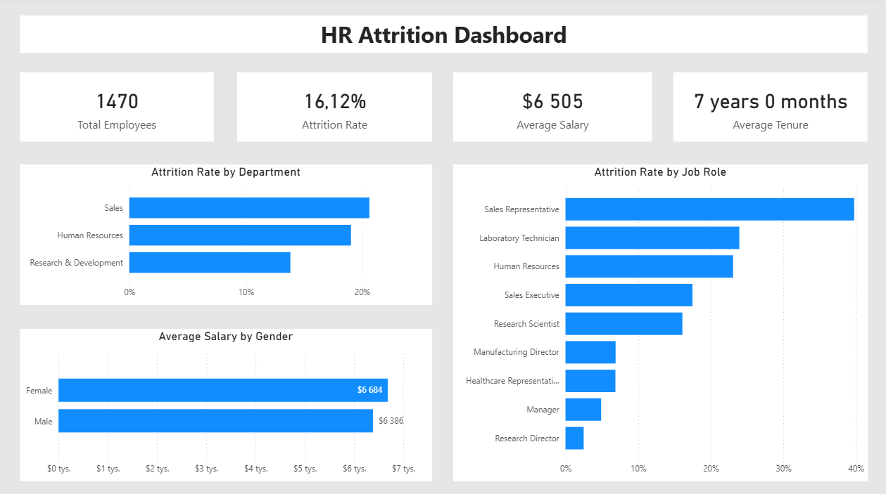
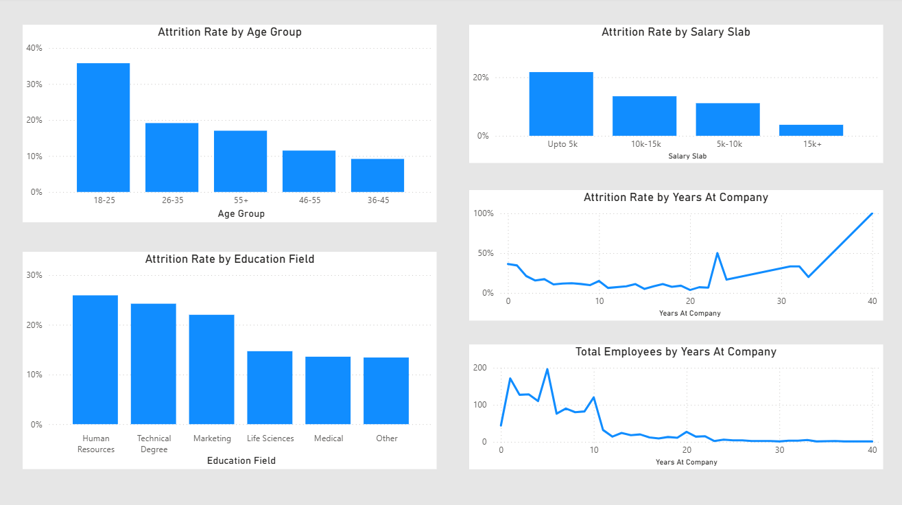
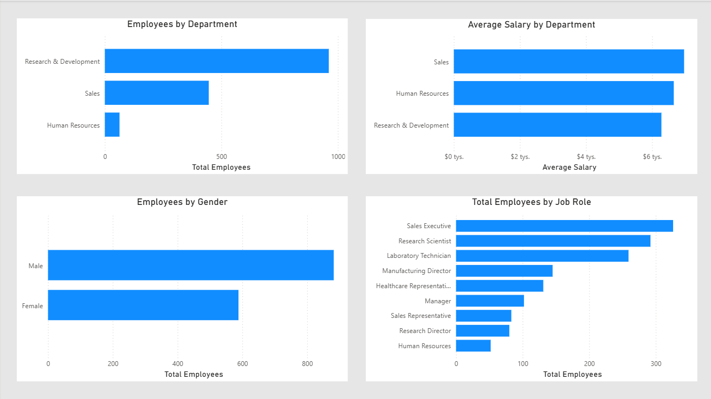

# powerbi-hr-attrition-analysis
HR Attrition Analysis – Power BI Dashboard

This is my first data analysis project based on the HR Analytics Dataset from Kaggle.

The goal of this project was to analyze employee attrition and build a simple analytical dashboard.

Project Workflow

Data Import
The original dataset was imported into Microsoft SQL Server as a single table named HR_Analytics.

Data Modeling
Next, I transformed the dataset into a star schema, creating one fact table and several dimension tables.
The complete SQL code used to create the schema is included in this repository.

Data Visualization
Finally, I built an interactive dashboard in Power BI to analyze employee attrition and key HR metrics.

Tools Used

Microsoft SQL Server

SQL

Power BI

DAX

